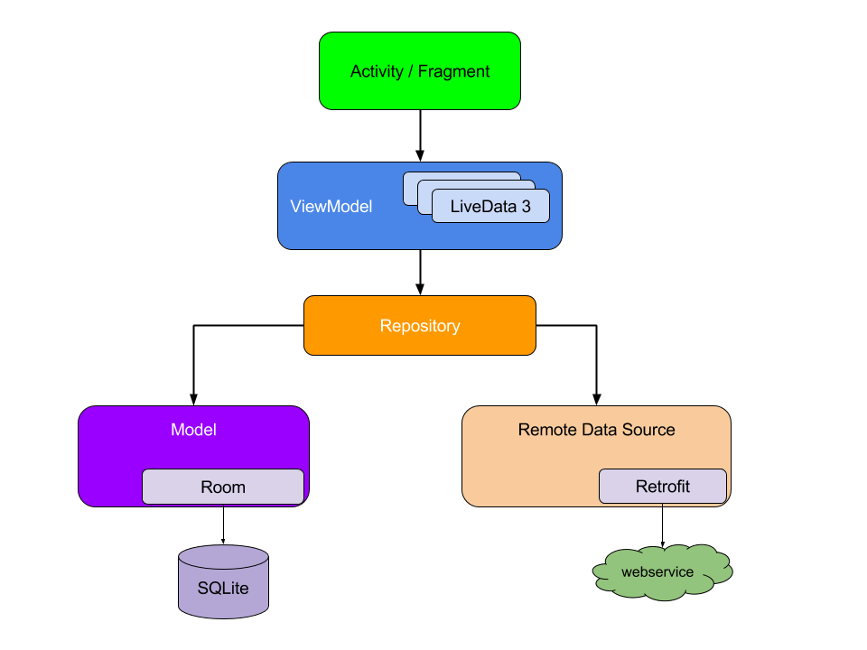

1. UI components are kept away from the business logic
2. Business logic is kept away from the database operations
3. Easy to understand and read
4. A lot less to worry when it comes to managing life cycle events

LiveData is an observable data holder class. Unlike a regular observable, LiveData is lifecycle-aware, meaning it respects the lifecycle of other app components, such as activities, fragments, or services. 
This awareness ensures LiveData only updates app component observers that are in an active lifecycle state.

https://developer.android.com/topic/libraries/architecture/livedata

